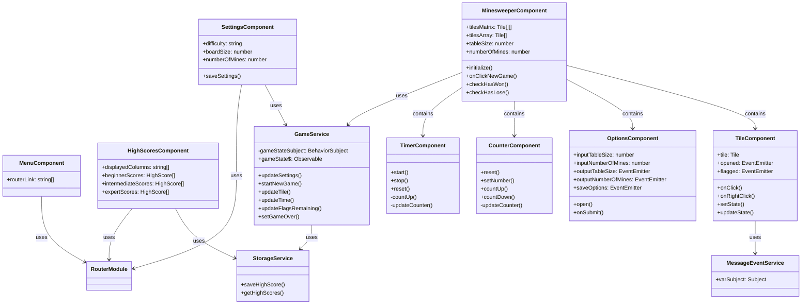

# Minesweeper

A modern implementation of the classic Minesweeper game built with Angular.

## Overview

This project is a Minesweeper game implemented using Angular. It maintains the classic Minesweeper gameplay while providing a modern UI and UX.

## Features

- Customizable game settings (board size, number of mines)
- Intuitive user interface
- Mouse click controls
- Right-click flag placement
- Game state display (remaining mines, elapsed time)
- Responsive design

## Tech Stack

- Angular 19
- TypeScript
- SCSS
- Angular Material

## Development Environment Setup

### Prerequisites

- Node.js (v18 or later)
- npm (v9 or later)
- Angular CLI (v19 or later)

### Installation

1. Clone the repository:
```bash
git clone https://github.com/yourusername/minesweeper.git
cd minesweeper
```

2. Install dependencies:
```bash
npm install
```

## Starting the Development Server

To start the development server, run the following command:

```bash
npm start
```

The application will be available at `http://localhost:4200`.

## Building

To create a production build:

```bash
npm run build
```

The built files will be generated in the `dist/` directory.

## Project Structure

```
minesweeper/
├── src/
│   ├── app/
│   │   ├── components/           # Reusable components
│   │   │   ├── tile/            # Individual game tile
│   │   │   ├── timer/           # Game timer display
│   │   │   ├── counter/         # Mine counter display
│   │   │   ├── options/         # Game options dialog
│   │   │   └── panel/           # Generic panel component
│   │   ├── pages/               # Page components
│   │   │   ├── minesweeper/     # Main game page
│   │   │   ├── menu/            # Main menu page
│   │   │   ├── settings/        # Game settings page
│   │   │   └── high-scores/     # High scores page
│   │   ├── services/            # Services
│   │   │   ├── game.service.ts  # Game state management
│   │   │   ├── storage.service.ts # High scores storage
│   │   │   └── messageEvent.service.ts # Event communication
│   │   ├── app.component.ts     # Root component
│   │   ├── app.config.ts        # Application configuration
│   │   └── app.routes.ts        # Routing configuration
│   ├── assets/                  # Static assets
│   │   └── images/             # Game images
│   └── styles.scss             # Global styles
```

## Class Diagram



## Available Scripts

- `npm start`: Start the development server
- `npm run build`: Create a production build
- `npm test`: Run tests
- `npm run lint`: Run ESLint
- `npm run lint:fix`: Run ESLint with auto-fix
- `npm run format`: Format code using Prettier
- `npm run format:check`: Check code formatting

## License

This project is licensed under the MIT License. See the [LICENSE](LICENSE) file for details.

## Author

Hidenori Takaku
